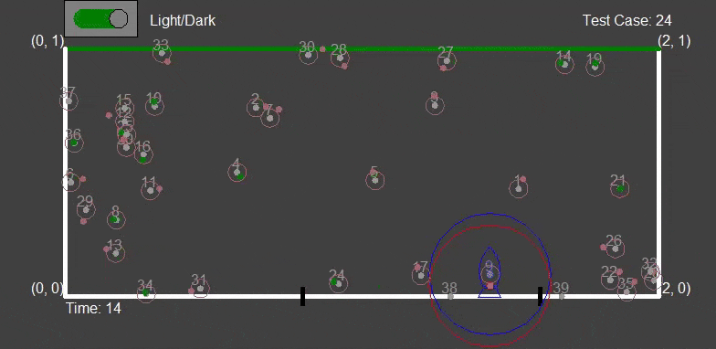
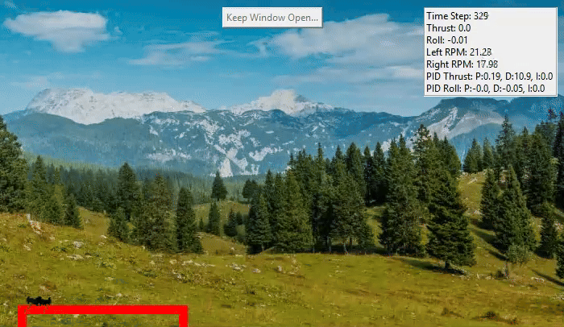
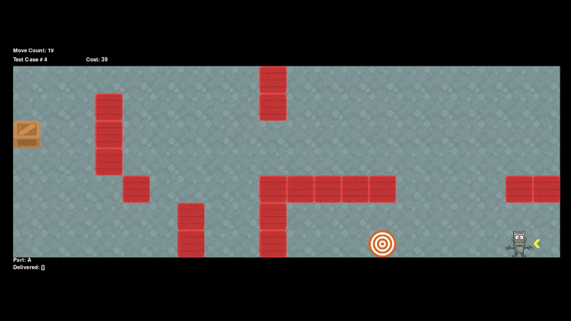
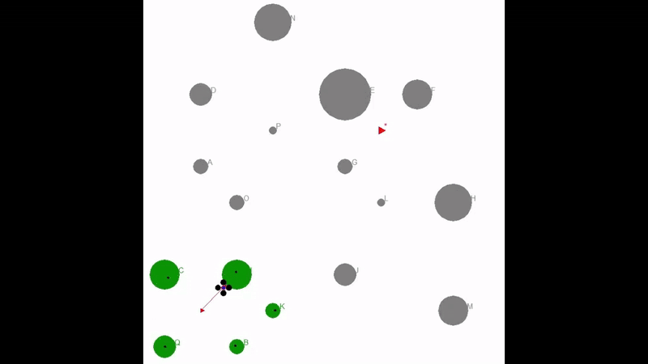

# Skyler Hawkins – Project Portfolio

**M.S. CS @ Georgia Tech | Focus: Artificial Intelligence**

_(Last updated: Dec 2025)_

Here is a collection of the projects I have completed during my time at Georgia Tech!
Due to academic integrity rules , I am unable to share source code for these projects, in lieu of that, I have
compiled some demo videos and a short descriptor outlining the techniques/methods used to implement them.

**Legacy Portfolio Site Link (Check it out!):  [Penn State Portfolio](https://iskyhawk0.github.io/skylerhawkins/)**
---

## Fall '25 - Robotics for AI and Game AI

## 🤖 Robotics AI 

### Spaceship Kalman Filter - Rocket Jump
---
- **What it is:** Simulation project implementing a Kalman Filter to localize a rocket ship's location in an asteroid field. The rocket is capable of jumping from asteroid to asteroid in a certain distance. 
- Over days of simulated time, the filter uses sensor readings to estimate asteroid positions to determine clear rocket jumps/paths to a goal. 
- **Tech:** Python · Kalman Filter
- **Description:** Shows the rocket and asteroids predicted and actual positions.
- BLUE: The location of the rocket and its ACTUAL jump range.
   --RED/GREEN CIRCLES: Predicted jump range, red is a bad guess (outside of acceptable error tolerance), green is a good guess (within the error tolerance) 
- WHITE DOTS: The actual location of the asteroids
  -- RED/GREEN DOTS: Predicted location of the asteroids: red is a bad guess (outside of acceptable error tolerance), green is a good guess (within the error tolerance) 

##### Rocket jumping from asteroid to asteroid until it reaches goal line

---

### Solar System Particle Filter – Satellite Localization

- **What it is:** Simulation project implementing a Particle Filter to localize a man-made satellite in a solar system using only noisy gravimeter measurements and a motion model.
- Over many days of simulated time, the filter fuses sensor readings and control inputs to recover the satellite’s unknown orbit around the sun to within 0.01 AU.
- **Tech:** Python · Particle Filter

**Description:** Shows the satellite in orbit while a cloud of particles starts spread across the solar system and gradually collapses onto the true trajectory as the filter incorporates new gravimeter readings and motion updates.
- SUN: Yellow circle in the middle
- OTHER PLANETS: Green circles
- SATELLITE POSITION: Red dot
- PREDICTED POSITION: Blue square
- PARTICLES: White triangles
  

##### Filter gradually converging on sattelite location
---

### Drone PID Controller - Dual Rotor
---
- **What it is:** Utilizing Twiddle routine to tune drone flight to follow desired path.
- The thrust and roll of both of the drones propellors is tuned automatically to produce the desired path (shown by the red line) ahead of time, these parameters are then used in drone flight.
- **Tech:** Python · PID Control 
- **Description:**  Depicts the drone's desired flight path (shown by red line) and various flight parameters (top right).

---
### Warehouse Search/Policy - A*
---

- **What it is:** Simulation project simulating using a robot to move packages around a warehouse. 
- The Robot must locate and retrive the package in a minimal amount of efforts, as well as explore a minimum amount of the warehouse to do so (for search specifically, policy views entire warehouse) 
- **Tech:** Python · A*
- **Description:** The Robot traverses a grid warehouse to find the box and the drop off location (the target)

---

### Drone SLAM - Indiana Drones
---

- **What it is:** Simulation project bringing together all parts of the course to make a drone that is able to navigate terrain using the SLAM algorithm. 
- **Tech:** Python · SLAM
- **Description:** An online SLAM pipeline and navigation planner that fuses noisy range–bearing measurements and motion commands to localize the drone,
  map tree obstacles, and autonomously path to and extract a hidden treasure while avoiding collisions.

## 🎮 Game AI

